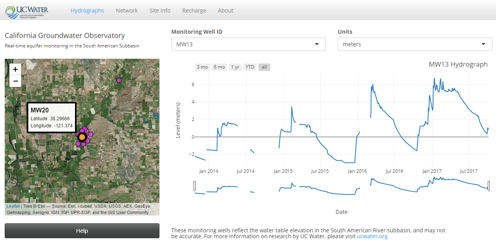

# About 

This repo contains all the scripts necessary to build an interactive web dashboard for a groundwater observatory in the open source language R.  

As an example, please see the [Cosumnes River Groundwater Observatory](ucwater.org/gw_obs), a project of UC Water.  

  
 

# Contents

The `clean` folder contains scripts that are automatically run every day at 04:00:00. Together these scripts:  

* retrieve data from [Solinst](https://www.solinst.com/) hardware  
* clean and transform the data  (i.e. - adjust for reference elevation, baromaetric pressure)  
* generate a report of remaining battery life and recent monitoring well data and email that report to a contact list  
* push a clean version of the database to the cloud  
* save versions of the database every 7 days to the cloud  

The `dashboard` folder contains (among other files), the three files comprising an [R Shiny App](https://shiny.rstudio.com/): 

* `global.R`  
* `server.R`  
* `ui.R`  

Together, these files build the app.  

# Shiny Server

On shiny server, the app files are located at `/srv/shiny-server/gw_obs`.  

# Repurposing this code

 This work is licensed under a <a rel="license" href="http://creativecommons.org/licenses/by/4.0/">Creative Commons Attribution 4.0 International License</a>.

If you aim to set of a monitoring well network of your own, this software is free to use for commercial and non-commercial purposes. Please reference this work in your derivative products.  

You will need a skilled R programmer familiar with Shiny to integrate your hardware with this software.  

On that note, the `log.md` file in the main directory is a daily log of activities during the process of building the app and contains valuable insights for those following in these footsteps.  

